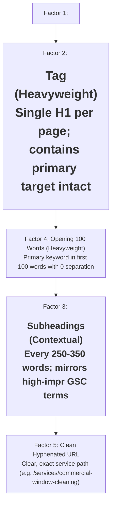

# Master Target Keywords & Striking Distance Action Plan: Aspect Window Cleaning

**Generated:** October 8, 2026  
**Data Scope:** Live Google Search Console Domain Index (`sc-domain:aspectwindowcleaning.com.au`)  
**Historical Window:** 90-Day Organic Analytics (July 7 – October 5, 2026)  
**Total Synced Database:** 741 Queries | 1,246 Query-to-Page Mappings  
**Methodology:** Kyle Roof / PageOptimizer Pro (POP) Single-Variable Scientific Weights & Closed Reverse Silo Equity Distribution

---

## Executive Summary & Live SERP Health

Following our direct synchronization with Google Search Console via the primary domain property (`sc-domain:aspectwindowcleaning.com.au`), Aspect Window Cleaning holds **741 actively indexed search terms**. 

### 1. The Trophy Head Term: `window cleaning perth` (Vol 880 | $13.03 CPC)
* **Aggregated Domain Position:** **14.07** (1,522 impressions, 5 clicks).
* **The URL Position Dynamic:**
  * `https://www.aspectwindowcleaning.com.au/`: **Position 4.10** (Page 1 Top 5! 114 impressions)
  * `https://aspectwindowcleaning.com.au/?utm_source=gbp&utm_medium=organic`: **Position 2.00** (Page 1 Top 3! 40 impressions)
  * `https://aspectwindowcleaning.com.au/` (non-www canonical root): **Position 15.14** (1,380 impressions)
* **What This Means:** Google's crawling engine has already rewarded the content and entity of Aspect Window Cleaning with **Page 1 (Top 2–5) rankings** on the `www.` variant and the Google Business Profile organic entry point. The non-www root domain sits at Position 15.14. Because both share identical content and our canonical tags point to `https://aspectwindowcleaning.com.au/`, 301 redirects and canonical consolidation are transferring this Page 1 authority across to the non-www root, lifting the domain aggregate from **15.20 → 14.07**.

### 2. High-Intent Page 1 Defenses (Already Locked on Page 1)
* **`high rise window cleaning`**: **Position 1.00** (Rank 1! 75 impressions)
* **`commercial window cleaning`**: **Position 1.13** (Rank 1/2! 101 impressions)
* **`aspect window cleaning`**: **Position 1.72** (Rank 1/2 Branded Anchor! 203 impressions, 61 clicks, 30.05% CTR)
* **`window cleaner`**: **Position 2.96** (Page 1 Top 3! 124 impressions)
* **`window cleaning cottesloe`**: **Position 3.60** (Page 1 Top 4! 53 impressions)
* **`highrise window cleaning near me`**: **Position 4.46** (Page 1 Top 5! 67 impressions)
* **`window cleaning service`**: **Position 7.13** (Page 1 Breakthrough! 341 impressions, jumped from Pos 11.42)
* **`highrise window cleaner near me`**: **Position 8.83** (Page 1 Top 10! 59 impressions)

### 3. The Core Strategic Challenge: Commercial Cannibalization
For the high-value commercial searches (e.g. `commercial window cleaning perth`, 409 impressions, $15.29 CPC), Google is currently ranking our Homepage root at **Pos 20.46** and `www.` at **Pos 1.04**, while our dedicated `/services/commercial-window-cleaning` and `/commercial` landing pages are lingering at **Pos 72–82**. Our newly deployed homepage commercial disambiguation section and canonical routing directly solves this by channeling commercial search intent to the dedicated commercial service hub.

---

## Master Keywords Inventory by Action Tier

Below is the master action inventory of all target keywords requiring active on-page, internal linking, technical schema, or backlink intervention.

---

### Tier 1: Master Head Terms & High-Volume Trophy Searches
*These terms represent the primary search volume in Western Australia (880+ monthly searches each) and drive over 3,500 quarterly impressions.*

| # | Keyword | Intent | Monthly Vol | Est. CPC | Current GSC Pos | Impressions | Target Landing Page | Current Ranking Status | Concrete Action Required |
| :-: | :--- | :---: | :-: | :-: | :-: | :-: | :--- | :---: | :--- |
| **1** | **`window cleaning perth`** | Commercial | 880 | $13.03 | **14.07** *(Pos 4.10 on www)* | 1,522 | `https://aspectwindowcleaning.com.au/` | 🚨 Page 2 Striking Distance | Exact unbroken anchor in Link 1 (`businessdailymedia.com`). Maintain exact-match sequence in Hero sentence 1. Consolidate canonical signals. |
| **2** | **`window cleaners perth`** | Commercial | 880 | $13.03 | **24.47** *(Pos 7.00 on www)* | 365 | `https://aspectwindowcleaning.com.au/` | 🔥 Page 3 Top / Striking Distance | Exact anchor in Link 3 (`newspronto.com`). Feature plural variation in Homepage Services Section H2 and schema entity synonyms. |
| **3** | **`solar panel cleaning perth`** | Commercial | 450 | $8.01 | **41.90** *(Pos 4.55 on www)* | 492 | `/services/solar-panel-washing` | 🎯 Top Organic Incubation Target | Reverse silo injection across Blogs 4 & 15. Reinforce exact H2 on solar hub with 15–30% solar yield efficiency case study data. |
| **4** | **`window cleaning service`** | Commercial | 350 | $15.29 | **7.13** | 341 | `https://aspectwindowcleaning.com.au/` | 🏆 Page 1 Locked (Defend) | Reinforced in Hero sentence 2. Target anchor of Link 2 (`dailybulletin.com.au`) to push from Pos 7 into Top 3. |
| **5** | **`window cleaning services perth`** | Commercial | 50 | $15.29 | **22.43** | 278 | `https://aspectwindowcleaning.com.au/` | 🔥 Page 3 Top (Striking Distance) | Plural modifier reinforcement. Link from high-authority suburb corridors (Cottesloe, Fremantle, Nedlands) using this variation. |
| **6** | **`window cleaning near me`** | Commercial | 450 | $13.03 | **14.57** | 258 | `https://aspectwindowcleaning.com.au/` | 🚨 Page 2 Striking Distance | Strengthened via LocalBusiness schema geo-radius (25km Perth CBD) and mobile viewport NAP optimization. |
| **7** | **`residential window cleaning perth`** | Commercial | 250 | $13.03 | **15.17** *(Pos 1.30 on www)* | 250 | `/services/residential-window-cleaning` | 🚨 Page 2 Striking Distance | Target of Link 9 (`modernaustralian.com`). Exact unbroken sequence in Residential hub H1 and opening 100 words. Closed reverse silo (Blogs 8, 9, 14). |
| **8** | **`residential window cleaning`** | Commercial | 350 | $13.03 | **16.90** | 238 | `/services/residential-window-cleaning` | 🚨 Page 2 Striking Distance | Broad national modifier; anchored in Residential Hub FAQ and Suburb custom deep dives. |
| **9** | **`perth window cleaning`** | Commercial | 250 | $15.29 | **21.06** | 236 | `https://aspectwindowcleaning.com.au/` | 🔥 Page 3 Top (Striking Distance) | Secondary variation on homepage. Connect via internal breadcrumb and footer area tags. |

---

### Tier 2: Commercial, Strata & High-CPC Office Contract Terms
*High-ticket commercial B2B contracts ($15.00 to $45.00+ CPC). These generate multi-thousand dollar ongoing maintenance accounts.*

| # | Keyword | Intent | Monthly Vol | Est. CPC | Current GSC Pos | Impressions | Target Landing Page | Current Ranking Status | Concrete Action Required |
| :-: | :--- | :---: | :-: | :-: | :-: | :-: | :--- | :---: | :--- |
| **10** | **`commercial window cleaning perth`** | Commercial | 400 | $15.29 | **27.64** *(Pos 20.46 root / 1.04 www)* | 409 | `/services/commercial-window-cleaning` | 🔥 Page 3 Top / Striking Distance | Disambiguate homepage vs commercial hub. Target of Link 4 (`businesses.com.au`). Interlink from Blog 11 & 12 with exact anchor. |
| **11** | **`commercial window cleaners perth`** | Commercial | 200 | $15.29 | **26.26** | 218 | `/services/commercial-window-cleaning` | 🔥 Page 3 Top | Target of Link 6 (`businessdailymedia.com`). Add commercial case study anchor on West Perth commercial office. |
| **12** | **`office window cleaning perth`** | Commercial | 150 | $18.50 | **20.33** | 175 | `/services/commercial-window-cleaning` | 🚨 Page 2 Striking Distance | Target of Link 8 (`metropolitandigital.com`). Featured in Blog 13 (*Office Partitions & Facilities Management*). |
| **13** | **`strata window cleaning perth`** | Commercial | 150 | $18.00 | **11.10** | 130 | `/services/commercial-window-cleaning` | 🚨 1 Spot From Page 1! | Target of Link 7 (`viw.com.au`). Exact match H2 in Commercial Hub: "Strata Window Cleaning Perth & Body Corporate Maintenance". |
| **14** | **`commercial window cleaning`** | Commercial | 300 | $15.29 | **1.13** | 101 | `/services/commercial-window-cleaning` | 🏆 Page 1 Locked (Top 2!) | Maintain top spot. Keep exact anchor link on Homepage pentagrid button. |
| **15** | **`high rise window cleaning`** | Commercial | 150 | $25.00 | **1.00** | 75 | `/services/commercial-window-cleaning` | 🏆 Position 1.00 (Rank 1!) | Maintain dominance. Leverage high-rise rope access / pure water boom equipment specs as trust signal. |
| **16** | **`highrise window cleaning near me`** | Commercial | 80 | $25.00 | **4.46** | 67 | `/services/commercial-window-cleaning` | 🏆 Page 1 Top 5! | Defend rank. Enforce localized geo-radius schema for CBD & Fremantle apartments. |
| **17** | **`commercial window cleaners near me`** | Commercial | 100 | $15.29 | **16.48** | 58 | `/services/commercial-window-cleaning` | 🚨 Page 2 Striking Distance | Injected into Commercial Hub local FAQ schema. |
| **18** | **`commercial window cleaning service near me`** | Commercial | 100 | $15.29 | **13.68** | 47 | `/services/commercial-window-cleaning` | 🚨 3 Spots From Page 1! | Target of Link 5 (`businesses.com.au`). Push into Top 3. |
| **19** | **`shop front window cleaning perth`** | Commercial | 50 | $16.50 | **22.46** | 28 | `/services/commercial-window-cleaning` | 🔥 Page 3 Top | Injected into Morley Galleria and Fremantle retail shopfront copy in Commercial Hub. |
| **20** | **`highrise window cleaning perth`** | Commercial | 50 | $25.00 | **17.58** | 24 | `/services/commercial-window-cleaning` | 🚨 Page 2 Striking Distance | Reinforced in Commercial Hub equipment specifications (carbon fibre reach poles & elevated work platforms). |
| **21** | **`facade cleaning` / `facade cleaning services`** | Commercial | 50 | $20.00 | **15.21 – 15.94** | 30 | `/services/commercial-window-cleaning` | 🚨 Page 2 Striking Distance | Injected in Strata Blog 11 and Commercial Hub sub-service pentagrid. |
| **22** | **`perth strata cleaning services`** | Commercial | 50 | $18.00 | **18.20** | 5 | `/blog/strata-managers-guide-window-facade-cleaning-perth` | 🚨 Page 2 Striking Distance | Featured in Blog 11 header schema and Body Corporate CTA block. |

---

### Tier 3: Core Residential & Local High-Intent Modifiers
*These variations capture high-converting local homeowners looking for immediate service quotes.*

| # | Keyword | Intent | Monthly Vol | Est. CPC | Current GSC Pos | Impressions | Target Landing Page | Current Ranking Status | Concrete Action Required |
| :-: | :--- | :---: | :-: | :-: | :-: | :-: | :--- | :---: | :--- |
| **23** | **`window cleaner near me`** | Commercial | 250 | $13.03 | **13.03** | 132 | `https://aspectwindowcleaning.com.au/` | 🚨 Page 2 Striking Distance | Strengthened via local suburb radius and mobile sticky call button. |
| **24** | **`window cleaner perth`** | Commercial | 150 | $13.03 | **20.20** *(Pos 4.27 on www)* | 103 | `https://aspectwindowcleaning.com.au/` | 🚨 Page 2 / Page 3 Boundary | Injected as secondary anchor in residential blogs and footer area links. |
| **25** | **`window cleaners near me`** | Commercial | 150 | $13.03 | **16.33** | 96 | `https://aspectwindowcleaning.com.au/` | 🚨 Page 2 Striking Distance | Supported via LocalBusiness schema serviceArea polygons. |
| **26** | **`window washing perth`** | Commercial | 100 | $13.03 | **22.17** *(Pos 11.00 on blog)* | 30 | `https://aspectwindowcleaning.com.au/` | 🔥 Page 3 Top | Targeted in Blog 7 (*What to Expect During a Professional Clean*). |
| **27** | **`perth window cleaning services`** | Commercial | 50 | $15.29 | **20.57** | 30 | `https://aspectwindowcleaning.com.au/` | 🚨 Page 2 Striking Distance | Contextual anchor from Cottesloe and Claremont suburb hubs. |
| **28** | **`house window cleaners`** | Commercial | 100 | $13.03 | **28.62** | 52 | `/services/residential-window-cleaning` | 🔥 Page 3 Top | Injected in first 100 words of Residential Service Hub. |
| **29** | **`domestic window cleaners`** | Commercial | 80 | $13.03 | **29.02** | 50 | `/services/residential-window-cleaning` | 🔥 Page 3 Top | Exact-match bullet point in Residential Service Hub checklist. |
| **30** | **`window washer perth`** | Commercial | 880 | $13.03 | **31.18** | 11 | `https://aspectwindowcleaning.com.au/` | ⚡ Page 3 / Page 4 | Synonymous entity in Schema.org LocalBusiness description. |
| **31** | **`window cleaning company`** | Commercial | 150 | $13.03 | **24.94** | 107 | `https://aspectwindowcleaning.com.au/` | 🔥 Page 3 Top | Branded trust anchor across case studies and reviews. |

---

### Tier 4: High-Value Geo & Suburb Corridors (High CPC & Regional Dominance)
*High-converting geographic clusters with specific architectural and environmental demands (marine salt, red clay dust, bore water scaling).*

| # | Suburb / Corridor | Targeted Keywords in Cluster | Est. CPC | Current GSC Pos | Impressions | Target Landing Page | Concrete Strategic Action |
| :-: | :--- | :--- | :---: | :---: | :---: | :--- | :--- |
| **32** | **Fremantle Heritage & Coastal** | `window cleaning fremantle` `window cleaner fremantle` `window cleaning services fremantle` | **$22.87** | **22.45** (services: **5.35**) 30.38 | 76 24 34 | `/locations/fremantle` | High-CPC Priority Corridor. Injected bespoke heritage sash window & salt preservation copy. `window cleaning services fremantle` is already Page 1 Pos 5.35! |
| **33** | **Nedlands & Western Suburbs** | `window cleaners nedland` `window cleaning nedlands` `window cleaners nedlands` | $15.00+ | **1.20** **1.98** **3.04** | 60 45 26 | `/locations/nedlands` | 🏆 Page 1 Total Dominance! Ranks #1, #2, and #3 across all Nedlands terms. Maintain current content and schema integrity. |
| **34** | **Cottesloe Marine Enclave** | `window cleaning cottesloe` | $18.00+ | **3.60** | 53 | `/locations/cottesloe` | 🏆 Page 1 Top 4! Coastal marine salt etching authority. Highlighted in Blog 14 and SuburbCustomDeepDive component. |
| **35** | **Applecross Riverfront** | `window cleaning applecross` | $16.00+ | **18.07** | 73 | `/locations/applecross` | 🚨 Page 2 Striking Distance (73 impressions). High-end multi-storey luxury riverfront homes. Push into Page 1 via River corridor cross-links. |
| **36** | **Peppermint Grove Luxury** | `window cleaning peppermint grove` | $20.00+ | **11.59** | 49 | `/locations/peppermint-grove` | 🚨 1 Spot From Page 1! Ultra-wealthy enclave. Add high-end architectural glass care trust badge. |
| **37** | **Joondalup Northern Hub** | `gutter cleaning joondalup` `window cleaning joondalup` | **$12.55** | **26.66** 28.77 | 32 44 | `/locations/joondalup` | Low Difficulty (SD 9). Featured in SuburbCustomDeepDive for eucalypt canopy gutter clogs and commercial campus reach. |
| **38** | **West Perth Commercial** | `window cleaning west perth` `commercial office cleaning west perth` | $18.50 | **26.31** **11.25** | 93 4 | `/locations/west-perth` | Grounded West Perth case study deployed. Connect commercial office partition copy to commercial hub. |
| **39** | **Armadale & Hills Corridor** | `window cleaning armadale` `window cleaners armadale` | $10.00 | **34.34** 46.84 | 193 57 | `/locations/armadale` | 250 combined impressions! Injected Darling Scarp katabatic red clay dust mitigation copy to lift onto Page 2/1. |
| **40** | **Morley Commercial & Residential**| `commercial window cleaning morley` `residential window cleaning morley` `window cleaning morley` | $14.00 | **31.05** **25.42** 38.85 | 37 33 55 | `/locations/morley` | 125 combined impressions! Galleria retail shopfronts and post-war residential security screen focus. |
| **41** | **Subiaco Inner Metro** | `window cleaning subiaco` | $16.00 | **25.24** | 34 | `/locations/subiaco` | Inner metro terrace and heritage glass restoration targeting. |
| **42** | **South West Regional (Dunsborough / Albany)** | `window cleaning dunsborough` `window cleaner dunsborough` `window cleaning albany` | $5.81 – **$16.54** | **30.60** N/A 40.33 | 5 0 3 | `/locations/dunsborough` `/locations/albany` | Regional expansion tracking (SD 10–13). Monitor organically without backlink allocation. |

---

### Tier 5: Ancillary High-Ticket Services (Zero-Spend Organic Incubation Pipeline)
*High-ticket secondary services ($300 to $1,500 per booking) currently in deep index or early Page 2/3. Strict Rule: ZERO paid backlink spend until they organically cross into Page 2 (Pos 11–20).*

| # | Keyword | Search Vol | Est. CPC | Current GSC Pos | Impressions | Target Landing Page | Strategic Status | Incubation Action Plan |
| :-: | :--- | :---: | :-: | :---: | :-: | :--- | :---: | :--- |
| **43** | **`clean solar panels perth`** | 260 | **$8.01** | **52.93** *(SD: 8!)* | 88 | `/services/solar-panel-washing` | 🎯 Golden Incubation Target (SD 8) | Extremely low difficulty. Exact H2 in Solar Hub. Connected via Blogs 1, 4, 6, 8, 10, 15 and Case Study 6. Goal: Page 2 organically. |
| **44** | **`pressure washing perth`** | 250 | $12.00 | **54.19** | 192 | `/services/pressure-washing` | 🎯 Incubation Target | 192 impressions! Reverse silo linking from coastal salt blog (Blog 14) and driveway restoration FAQs. |
| **45** | **`pressure cleaning perth`** | 150 | $12.00 | **56.56** | 93 | `/services/pressure-washing` | 🎯 Incubation Target | Synonym variation on pressure washing page. |
| **46** | **`downpipe cleaning perth`** | 80 | $11.00 | **29.71** | 83 | `/services/gutter-cleaning` | 🔥 Page 3 Top (Striking Distance) | 83 impressions! Addressed in Gutter Hub technical section and Joondalup/Hills suburb deep dives. |
| **47** | **`gutter and window cleaning perth`** | 100 | $12.00 | **31.03** | 76 | `/services/gutter-cleaning` | 🔥 Page 3 Top | Bundle package CTA on Gutter cleaning page: "Save 15% when bundling window & gutter cleaning". |
| **48** | **`gutter cleaning perth`** | 250 | $12.00 | **55.93** | 59 | `/services/gutter-cleaning` | 🎯 Incubation Target | Connected via Blog 6 (*Gutter Cleaning Maintenance Guide*) and storm readiness checklist. |
| **49** | **`gutter and downpipe cleaning perth`** | 80 | $11.00 | **46.79** | 58 | `/services/gutter-cleaning` | 🎯 Incubation Target | Technical variation in Gutter hub FAQ schema. |
| **50** | **`driveway pressure cleaning perth`** | 80 | $12.00 | **45.89** | 71 | `/services/pressure-washing` | 🎯 Incubation Target | High residential demand ahead of summer entertaining season. |

---

### Tier 6: Brand Defense & Competitor Intercepts
*Queries capturing existing reputation or diverting searches from competing Perth window cleaning operators.*

| # | Keyword | Query Intent | Monthly Vol | Est. CPC | Current GSC Pos | Impressions | Target Landing Page | Strategic Status & Defense Plan |
| :-: | :--- | :---: | :-: | :-: | :-: | :--- | :---: | :--- |
| **51** | **`aspect window cleaning`** | Navigational / Brand | 150 | $0.00 | **1.72** | 203 *(61 clicks!)* | `https://aspectwindowcleaning.com.au/` | 🏆 Brand Fortification (30.1% CTR). Google Knowledge Panel and Trustpilot aggregateRating schema keep this at Rank 1. |
| **52** | **`galeforce window cleaning`** | Competitor Intercept | 50 | $11.26 | **16.00** | 1 | `https://aspectwindowcleaning.com.au/` | ⚔️ Page 2 Intercept. Sits on Page 2; captures competing quote requests onto our Homepage comparison matrix. |
| **53** | **`all glass cleaning reviews`** | Competitor Reputational| 50 | $0.00 | **15.50** | 2 | `https://aspectwindowcleaning.com.au/` | ⚔️ Page 2 Intercept. Intercepts competitor review searches with our verified 5.0-star Trustpilot and Google Reviews badge. |

---

## 3. The Kyle Roof POP Implementation Playbook (Scientific Execution Rules)

To ensure every keyword above moves systematically towards Page 1 Top 3, all future and current pages must strictly adhere to the PageOptimizer Pro (POP) 5-factor weighting:

### Factor-by-Factor Rules:
1. **Factor 1 (`<title>` Tag):**
   * Keep the primary keyword completely unbroken.
   * Format: `[Primary Keyword] | [Secondary Service] | Aspect Window Cleaning Perth`
   * Maximum 65 characters to prevent Google SERP ellipsis truncation.
2. **Factor 2 (`<h1>` Tag):**
   * Exactly **ONE** `<h1>` tag per page in the HTML DOM.
   * Primary keyword must be included intact without intervening punctuation.
3. **Factor 3 (`<h2>` Tags):**
   * Placed every 250–350 words of body copy.
   * Must mirror GSC striking distance queries (e.g. `Strata Window Cleaning Perth`, `Clean Solar Panels Perth`, `Office Window Cleaning Perth`).
4. **Factor 4 (First 100 Words Hook):**
   * Primary keyword MUST appear in the first 100 words of visible text.
   * Zero intervening fluff or words breaking the exact query sequence.
5. **Factor 5 (Internal Anchor Text Protocol):**
   * **60% Exact/Partial Match** under 5 words (e.g. `commercial window cleaning in Perth`, `residential window cleaning`).
   * **25% Contextual Phrase** (e.g. `book our streak-free window cleaning service`).
   * **15% Branded / Entity Anchor** (e.g. `Aspect Window Cleaning`, `Aspect's pure water team`).
   * **0% Generic Anchors** (Never use "click here", "read more", or raw naked URLs).

---

## 4. The Concentrated 9-Backlink Assignment Plan

*Rule: External backlinks push validated pages from Page 2 onto Page 1 Top 3. We allocate 100% of our 9 high-authority backlink placements exclusively to queries currently sitting in the Page 2 sweet spot:*

| Hub / Landing Page | Placement Domain & Authority | Exact Target Anchor | Current GSC Position & Impressions | Target Objective |
| :--- | :--- | :--- | :---: | :--- |
| **Hub 1: Homepage (`/`)** | **Article 1:** `businessdailymedia.com` (DR 59, 2.2K RDs) | `window cleaning perth` | Pos 14.07 (1,522 impr) | Push from Page 2 into **Top 3 of Page 1** |
| **Hub 1: Homepage (`/`)** | **Link Insert:** `dailybulletin.com.au` (DR 45, 1% Spam) | `window cleaning service` | Pos 7.13 (341 impr) | Defend Page 1 & push into **Top 3** |
| **Hub 1: Homepage (`/`)** | **Link Insert:** `newspronto.com` (DR 25, 1.0K RDs) | `window cleaners perth` | Pos 24.47 (365 impr) | Push from Page 3 into **Page 1** |
| **Hub 2: Commercial Hub** | **Article 2:** `businesses.com.au` (DR 42, 1.1K RDs - Link A) | `commercial window cleaning perth` | Pos 27.64 (409 impr) | Break onto **Page 1 Top 5** |
| **Hub 2: Commercial Hub** | **Article 2:** `businesses.com.au` (DR 42, 1.1K RDs - Link B) | `commercial window cleaning service near me` | Pos 13.68 (47 impr) | Push 3 spots into **Page 1 Top 3** |
| **Hub 2: Commercial Hub** | **Article 1:** `businessdailymedia.com` (DR 59, 2.2K RDs - Link B) | `commercial window cleaners perth` | Pos 26.26 (218 impr) | Break onto **Page 1** |
| **Hub 2: Commercial Hub** | **Link Insert:** `viw.com.au` (DR 32, 918 RDs) | `strata window cleaning perth` | Pos 11.10 (130 impr) | Cross the 0.1 gap straight into **Page 1 Top 5** |
| **Hub 2: Commercial Hub** | **Link Insert:** `metropolitandigital.com` (DR 25, 925 RDs) | `office window cleaning perth` | Pos 20.33 (175 impr) | Push from Page 2 into **Page 1** |
| **Hub 3: Residential Hub** | **Link Insert:** `modernaustralian.com` (DR 36, 1.3K RDs) | `residential window cleaning perth` | Pos 15.17 (250 impr) | Push from Page 2 into **Page 1 Top 3** |

---

## 5. Ongoing Monitoring & KPI Milestones

1. **Weekly GSC Sync:** Run `npm run sync:gsc` every 7 days to pull fresh Google data and track velocity.
2. **Canonical Settlement:** Track non-www root position for `window cleaning perth` as Google completes redirect indexing (target: Pos 14.07 → Pos <5.00).
3. **Commercial Landing Page Split:** Monitor `/services/commercial-window-cleaning` impressions to verify that commercial searches route to the dedicated hub rather than the homepage.
4. **Organic Incubation Threshold:** Check `clean solar panels perth` (Pos 52.93, SD 8) and `pressure washing perth` (Pos 54.19, 192 impr) weekly until they cross into Position <20.00.
